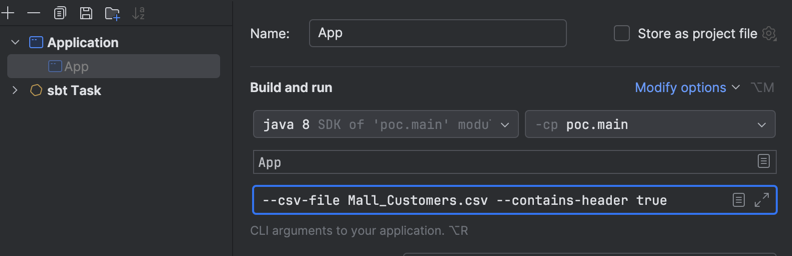

# NOTE

This is just for allow program to be more flexible

Modify program to use argument as show below
`--csv-file Mall_Customers.csv --contains-header true`




## OUTPUT

Insert successfully
```text
Input options:
Map(--csv-file -> Mall_Customers.csv, --contains-header -> true)
```